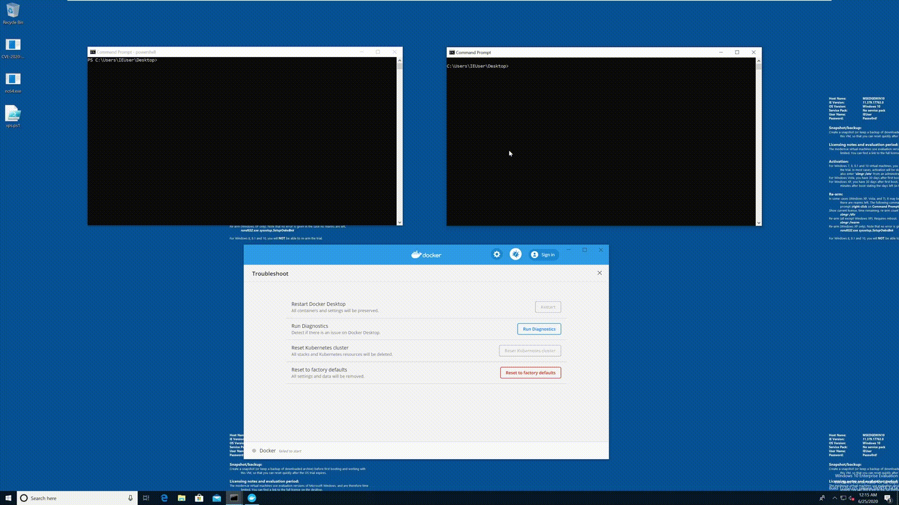

# CVE-2020-10665 Docker Desktop Local Privilege Escalation

POC for Docker Desktop Local Privilege Escalation. Built based on the writeup at https://www.activecyber.us/activelabs/docker-desktop-local-privilege-escalation-cve-2020-10665.

Hardlink creation adapted from https://github.com/googleprojectzero/symboliclink-testing-tools.

This exploit grants full control permissions for the Everyone group to `C:\\Windows\\System32\\DriverStore\\FileRepository\\prnms003.inf_amd64_a337db27fa50b915\\Amd64\\PrintConfig.dll`. To affect other files, simply change the line `LPCWSTR dllPath = L"C:\\Windows\\System32\\DriverStore\\FileRepository\\prnms003.inf_amd64_a337db27fa50b915\\Amd64\\PrintConfig.dll";` in `CVE-2020-10665/CVE-2020-10665.cpp`.

By overwriting `PrintConfig.dll`, attackers can escalate arbitrary file overwrite to SYSTEM access based on the steps at https://decoder.cloud/2019/11/13/from-arbitrary-file-overwrite-to-system/. You will need to modify the `xps.ps1` script in that writeup to point to the matching `PrintConfig.dll` path on the target system as well as generate your own reverse shell payload DLL.

## Affected Products

* Docker Desktop Enterprise before 2.1.0.9
* Docker Desktop for Windows Stable before 2.2.0.4
* Docker Desktop for Windows Edge before 2.2.2.0

Due to the hardlink mitigation introduced in the March 2020 Windows cumulative update, this exploit only works on prior versions of Windows.
